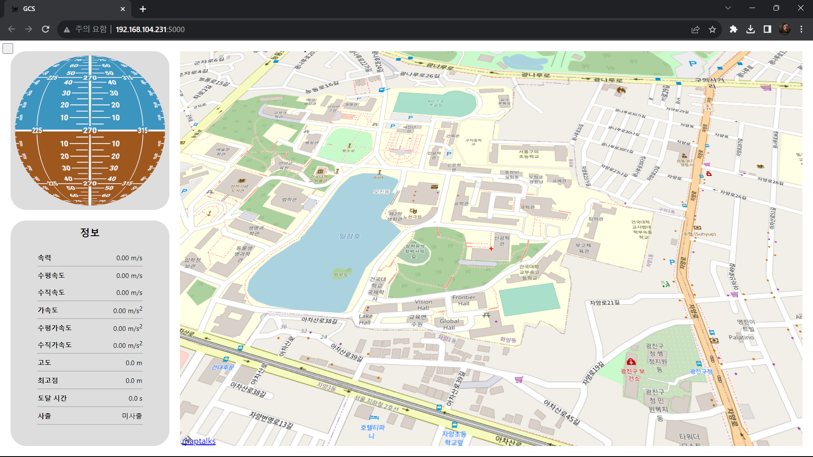
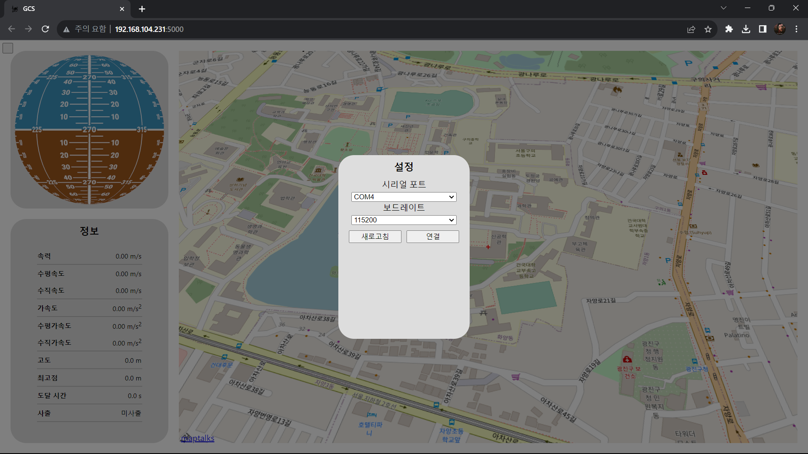
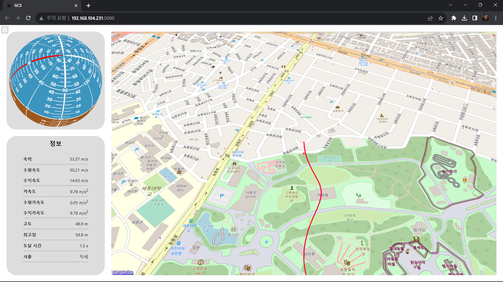

# 지상 통제 시스템

## GROUND CONTROL SYSTEM

2023 NURA, 건국대학교 항공우주동아리 ASEC GCS.

로켓으로부터 신호를 받아 시각화하기 위한 프로그램.\
2023년 10월 31일 현재 자세 및 위치 표시, 센서값 표시가 구현되어있다.\
Javascript 라이브러리 [React](https://react.dev)를 사용해 Single Page Application으로 제작하였다.

## 설치 방법

1. git, python, node.js 설치

[git](https://git-scm.com/)과 [python](https://www.python.org/), [node.js](https://nodejs.org/en)를 설치한다.

2. git 클론

윈도우 PowerShell에서 아래의 명령어를 입력해 저장소를 복제한다.

```
git clone https://github.com/wonbinyoon/NURA_GCS.git
```

3. 파이썬 라이브러리 설치

복제한 디렉토리로 이동한 뒤 필요한 파이썬 라이브러리(Flask, Flask-SocketIO, pyserial)를 설치한다.

```
pip install -r requirements.txt
```

4. npm 라이브러리 설치, 빌드

`npm i` 명령어를 통해 필요한 npm 라이브러리(react, three.js, socketio, maptalks 등)을 설치하고 웹사이트를 빌드한다.

```
npm i
npm run build
```

5. 실행

로그를 저장할 폴더 `log`를 생성한 뒤 `main.py`를 실행하고 콘솔창에 출력되는 주소로 웹 브라우저를 통해 접속한다.

```
mkdir log
python3 main.py
```

## 이미지

기본 화면

설정 화면

실행 화면

